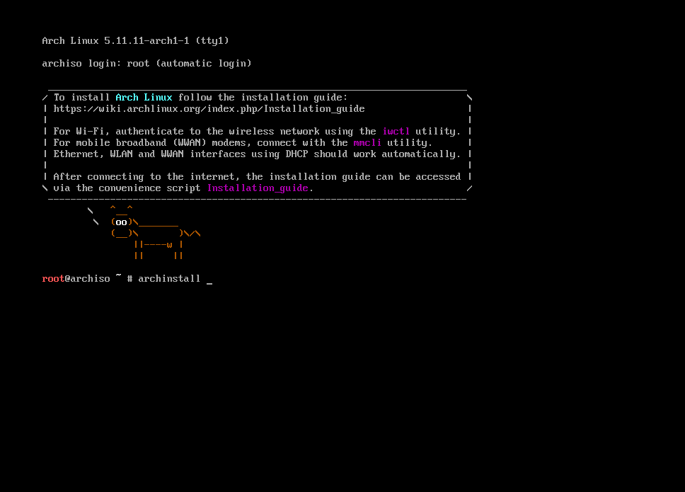

This simple guide will explain how to install Arch Linux on Bios systems. Methods and commands will probably change in time but the concept is not.

!! Disclaimer: If you're super new to the linux, maybe you should start with [Manjaro](https://manjaro.org/). Because do not apply these instructions to your production machine unless you know what you're doing. Also do not 100% trust what I shared here, always take [Arch Wiki](https://wiki.archlinux.org/title/Installation_guide) as a guide.

## Downloading and writing Arch on a usb drive

First of all we need to download latest version from [archlinux.org](https://archlinux.org/download/). Arch linux uses rolling releases, that means unlike Debian systems there'll be only one version. New updates and patches will be added to the top of the main release. That's why Arch linux is getting updates more often.

And then write the image to your usb drive. If you can choose your writing mode, choose dd (a.k.a disk destroyer :grinning:).

## Running Arch installation medium

Plug your usb drive into the installation device and boot from the usb. You should see a warm welcoming black terminal.



If you're not using english keyboard you should first set your keyboard layout. Find your layout by ls'ing deeper `/user/share/kbd/keymaps`.
I'm using Turkish Q keyboard and I found mine with:
```
# ls /usr/share/kbd/keymaps/i386/qwerty
```

To load your keyboard layout:
```
# loadkeys layout-name
For my keyboard:
# loadkeys trq
```

Next step, check internet connection. See your enabled network interfaces:
```
# ip link
```

I always prefer using ethernet because I don't really know how to connect wifi (I can't see my wifi adapter in the interfaces list) :sweat_smile: To check your internet connection ping your favourite website:
```
# ping berkaycubuk.com
```

If you receive packages you're connected.

### Update the system clock
Before installing we need to configure our target device. First update system clock:
```
# timedatectl set-ntp true
```

### Partition the disk
To check your disks:
```
# lsblk
```

Every device has it's own disks and labels, you have to find yours (Probably the big one).


And start partitioning. I'll use graphical version of fdisk:
```
You should type your disk name, mine is sda
# cfdisk /dev/sda
```

We're working with BIOS device so we just need to create boot and swap partitions.

For swap partition I'll set the size 12G because I like to give it the 150% of the ram size and I have 8 GB for this machine. But there are not strict rules, everybody uses their own way. It's should be primary and for type we'll pick Linux swap / Solaris (or just swap).

The next partition will be the root partition. You can give it the remaining space. It'll be primary as well, but this time type will be Linux.

After checking everything we can write it.

!! Important: When you write the changes your disk will be formatted and your personal files will be deleted.

Now you should see your changes with  `lsblk`. Ok, we can format the partitions for our needs.

To format root partition:
```
# mkfs.ext4 /dev/root_partition
```

To format swap partition:
```
# mkswap /dev/swap_partition
```

### Mount the file systems

We can mount the partitions we just created.

Mount the swap with:
```
# swapon /dev/swap_partition
```

Mount the root volume with:
```
# mount /dev/root_partition /mnt
```

### Install essential packages
We managed to survive :grinning: now we can install the core packages and a text editor to configure things later.
```
If you're not feeling comfortable with vim you can choose nano
# pacstrap /mnt base linux linux-firmware base-devel vim
```

### Fstab
We have to generate fstabl file to tell the system where are our partitions. To do that run:
```
# genfstab -U /mnt >> /mnt/etc/fstab
```

You can check the result from `/mnt/etc/fstab` file.

### Chroot
For this time we're running from the usb drive we plugged to the system. Now we have a base install to we can switch to the target machine.
```
# arch-chroot /mnt
```

### Time zone and locale
We can set our timezone with:
```
# ln -sf /usr/share/zoneinfo/Region/City /etc/localtime
For me:
# ln -sf /usr/share/zoneinfo/Europe/Istanbul /etc/localtime
```

Set the hardware clock to UTC:
```
# hwclock --systohc
```

Select the system language by uncommenting your_language.UTF-8 from `/etc/locale.gen`. After that run
```
# locale-gen
```

Create new file `/etc/locale.conf` and set LANG variable:
```
LANG=en_US.UTF-8
```

Also, if you want you can make your keyboard layout permanent by creating new file ``/etc/vconsole.conf` and set KEYMAP variable:
```
KEYMAP=trq
```

### Network
Create a new file to set hostname `/etc/hostname` and fill it with the name you want. And create a new file `/etc/hosts` and fill it with:
```
127.0.0.1      localhost
::1            localhost
127.0.1.1      hostname.localdomain      hostname
```

### Set root password
Right now we're using the root user and we have to set a password for it to login after the reboot.
Run `passwd` to set your password.

### Bootloader stuff
Now we can install the bootloader and other stuff we want to have when we rebooted the system.
```
# pacman -S grub networkmanager network-manager-applet dialog wireless_tools wpa_supplicant os-prober mtools dosfstools linux-headers
```

Run this to install grub:
```
# grub-install --target=i386-pc /dev/sda
```

Run this to create grub config:
```
# grub-mkconfig -o /boot/grub/grub.cfg
```

Now we have successfully installed bootloader

### Exit installation
Just type `exit` to exit and unmount all with:
```
# umount -a
```

Ok, we can reboot the system now with `reboot` command. If you're on your lucky day you should see the login page. Login with the root username and the password you created before.

### Hard part is over now configure and setup thing we want
Right now, we don't have internet connection. I will enable and start the NetworkManager
```
# systemctl enable NetworkManager
# systemctl start NetworkManager
```
After that, if you have a ethernet cable connected now you can use the internet. If you want to use wifi now you can do that with:
```
# nmtui
```

### Create new user
We can use root for all the time but it's not ideal, so I'll set up new user for the daily use.
```
# useradd -m -G wheel berkay
And I'll set password for the user
# passwd berkay
```

We added user to wheel group that means the user can use the magical `sudo` command. But the sudo command is not enabled.

Open the `/etc/sudoers` file and go all the way down to `# %wheel ALL=(ALL) ALL` and uncomment it.
```
To open sudoers file run
# EDITOR=vim visudo
```

Now we can exit and login to our newly created user.

### Video Driver
I don't know do we need it but it doesn't hurt:
```
If you are using Intel
# sudo pacman -S xf86-video-intel
If you are using AMD
# sudo pacman -S xf86-video-amdgpu
For the Nvidia
# sudo pacman -S nvidia nvidia-utils
```

### Display Server
We'll install Xorg for our display server:
```
# sudo pacman -S xorg-server xorg-xinit
```

### Window Manager
I like window managers so why not?
```
# sudo pacman -S i3-gaps i3status dmenu rxvt-unicode picom
```

### Fonts
Also we need some fonts to display:
```
# sudo pacman -S ttf-linux-libertine noto-fonts-emoji
```

### .xinitrc
We need create a new file called `.xinitrc` to define what to when we run `startx` to enter GUI mode.
```
picom &
exec i3
```

If you're having issue with the keyboard layout you can also add:
```
setxkbmap -layout layout_name &
```

### Run your xinit
We set up everything to start. You'll just need to run `startx` to enter your newly configured setup.

## Conlusion
You just installed Arch linux. We only did the base stuff, you can start to configure it to your taste.