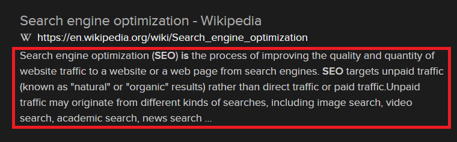

**Search Engine Optimization (SEO)** is making information more understandable and reachable for the internet.

To understand it better we have to know how websites are created. They're created with code, million lines of code! For a normal person, code is just big chunk of words & symbols. For search engines it different, it's information to display on your browser.

It's important to make the code clear & easy to understand for search engines. That's where we start to talk SEO. 

Ok, you made it magical, now give me an example:

    <meta name="description" content="Meta Description" />
    

This code shown you when you search something.

If you make your website more SEO efficent, your website will have a better chance to listed on the top, and that's why people are hiring SEO experts.

There is something we need talk about, when you do improvements on your SEO you won't see the results right after that, it takes some time. Because search engines need to index your new changes.
