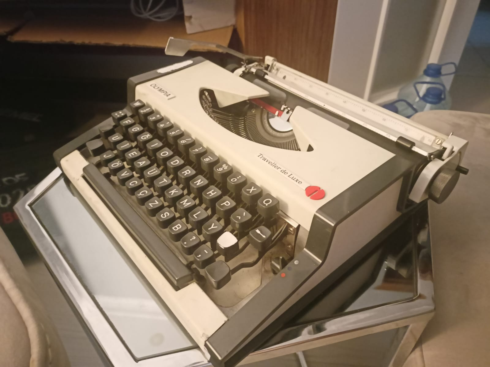
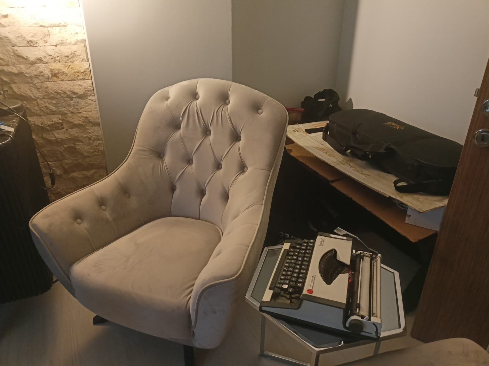

I started to write daily notes 2 months ago when I bought my first typewriter. I wrote journals for the last 4 years and saw great value. Now I experiment with daily notes by typing things out
as they occur. I spent most of my day in the house because I work from home, so taking notes is easy. There is a corner in my room dedicated for thinking and writing.

This habit started to happen thanks to my girlfriend. I try to write poems to her and typing them out using the typewriter is professional and quick. While I write poems, taking notes about the they started.
And I kept doing it since. I even documented all that into files and called that "Berkay'ın Aşırı Saçma Yaşam Rehberi" (This is in Turkish, translated as: "Super Stupid Guide to Living by Berkay").

Each daily note starts with the current date in DD.MM.YYYY - dddd format. And you type what happens in your head, just dump what you want to get it out. It's okay to do mistakes here, it's about making
your thinking clear. Also a great practice to express yourself, which is something I think people lack in today's world.

This habit is great for creating byproducts too, for example my girlfriend is went to her family's summer house, and I miss her since. There is enough content created to write a book about me missing her :^)

By doing this experiment and habit, I decided to do something similar with my website too. I'm following [Seth Godin's blog](https://seths.blog/) and he is one of the greatest examples of this.
He wrote everyday, sometimes short sometimes long. This hit me hard recently when I renew my website. I saw that I have posts from 2020 and felt that if I wrote everyday from then there will be lots of
text. So I'm thinking to spent some time writing publicly too, not sure is it going to be daily but will be more active than before :^)
