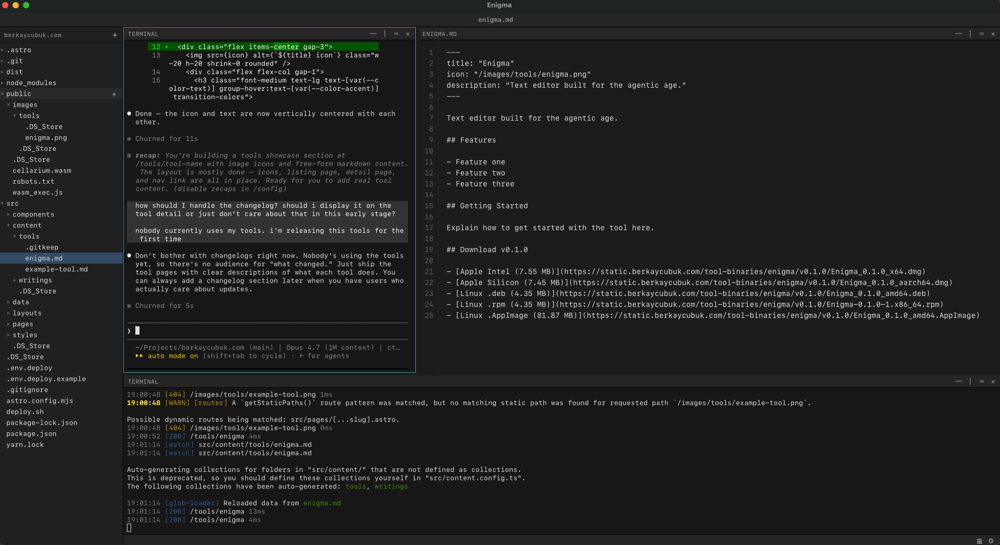
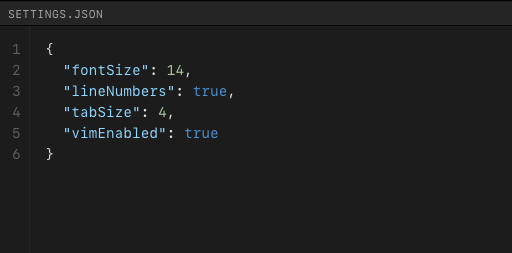
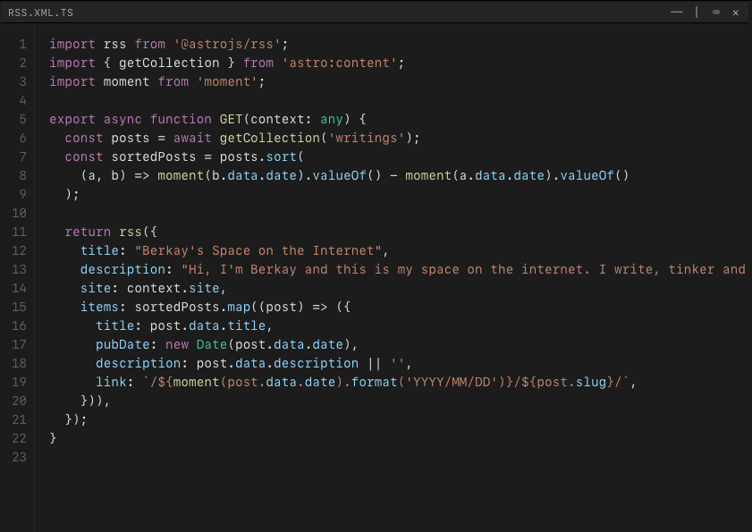

Text editor built for the agentic age. Inspired by Sublime Text and Tmux.

## Features

- Lightweight & fast.
- Tabs with multiple panes. Think like Tmux but GUI.
- Built-in Vim mode.
- Agentic usage focused.

## Download v0.1.0

This is the first release of Enigma so expect bugs and errors. **Use at your own risk**.

> Note for Apple users: I don't have Apple Developer account yet, so you'll encounter warnings about not trusted
developer..

- [Apple Intel (7.55 MB)](https://static.berkaycubuk.com/tool-binaries/enigma/v0.1.0/Enigma_0.1.0_x64.dmg)
- [Apple Silicon (7.45 MB)](https://static.berkaycubuk.com/tool-binaries/enigma/v0.1.0/Enigma_0.1.0_aarch64.dmg)
- [Linux .deb (4.35 MB)](https://static.berkaycubuk.com/tool-binaries/enigma/v0.1.0/Enigma_0.1.0_amd64.deb)
- [Linux .rpm (4.35 MB)](https://static.berkaycubuk.com/tool-binaries/enigma/v0.1.0/Enigma-0.1.0-1.x86_64.rpm)
- [Linux .AppImage (81.87 MB)](https://static.berkaycubuk.com/tool-binaries/enigma/v0.1.0/Enigma_0.1.0_amd64.AppImage)

## Support

If you encounter errors or just want to share a feedback, send me an e-mail: berkay@berkaycubuk.com