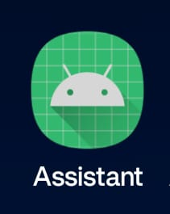
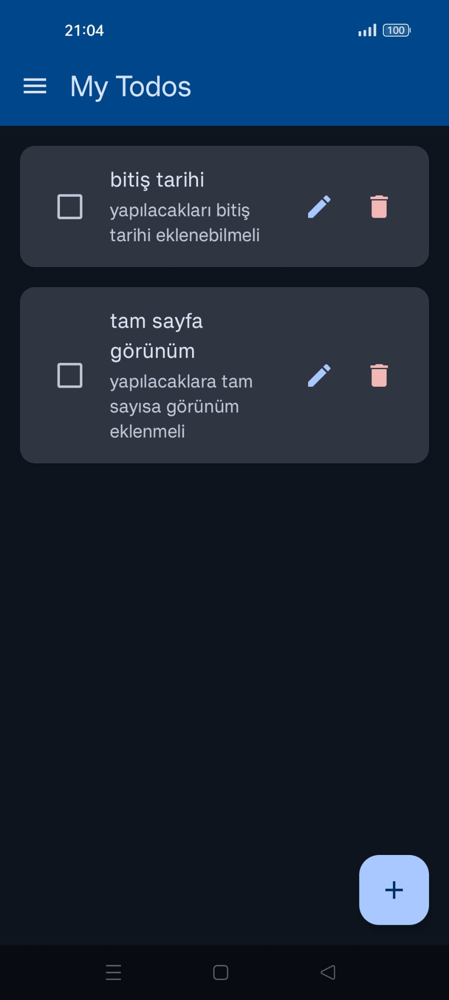
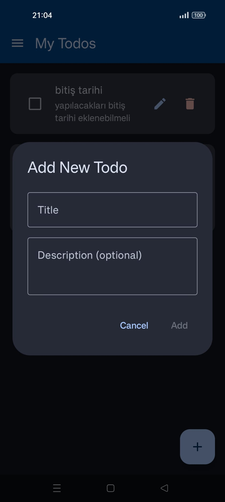
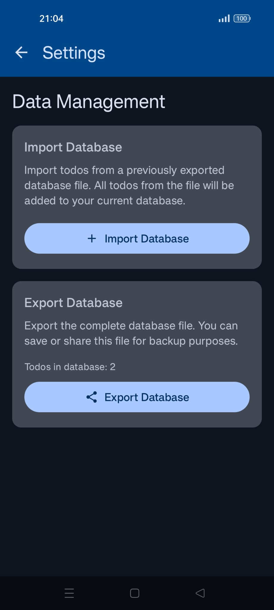

AI is everywhere and looks like it will stick with us.

I'm learning AI to leverage my engineering skills. Currently experimenting heavely with Claude Code and enjoying the experience.

Like everyone else I had issues to track my todos, including house related stuff like shopping lists, bills etc.. To solve this I'm developing a super super basic and simple todo app called "Assistant".

My goal is to develop it to fit my personal needs, and I started with todos.

It is easy to add new todos.

Everything stored in a local sqlite database in the device. I can export and import the database if needed. Most of the updates can delete the database so this feature helps a lot.

This app is built using Kotlin and I don't know how to write Kotlin, but thanks to Claude Code I managed to build something I enjoy. Claude Code is amazing but forces you to use Anthropic models. Found this amazing blog post ([how to build a coding agent: free workshop](https://ghuntley.com/agent/)) written by Geoffrey Huntley and it is a super basic introduction to building ai coding agents.
