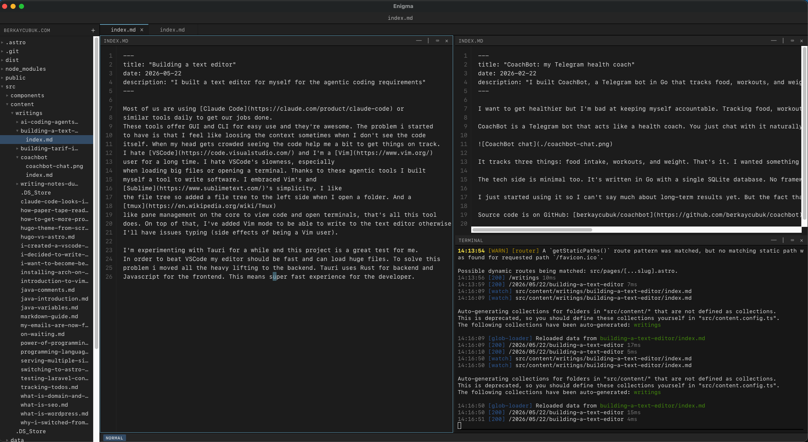

Most of us are using [Claude Code](https://claude.com/product/claude-code) or
similar tools daily to get our jobs done.
These tools offer GUI and CLI for easy use and they're awesome. The problem i started
to have is that I feel like loosing the context sometimes when I don't see the code
itself. When my head gets crowded seeing the code help me a bit to get things on track.
I hate [VSCode](https://code.visualstudio.com/) and I'm a [Vim](https://www.vim.org/)
user for a long time. I hate VSCode's slowness, especially
when loading big files or opening a terminal. Thanks to these agentic tools I built
myself a tool to write software. I embraced Vim's and
[Sublime](https://www.sublimetext.com/)'s simplicity. I like
the file tree so added a file tree to the left side when I open a folder. And a
[tmux](https://en.wikipedia.org/wiki/Tmux)
like pane management on the core to view code and open terminals, that's all this tool
does. On top of that, I've added Vim mode to be able to write to the text editor otherwise
I'll have issues typing (side effects of being a Vim user).

I'm experimenting with Tauri for a while and this project is a great test for me.
In order to beat VSCode my editor should be fast and can load huge files. To solve this
problem i moved all the heavy lifting to the backend. Tauri uses Rust for backend and
Javascript for the frontend. This means super fast experience for the developer.

Features I want to add for quick wins:
- Drag and drop files to the file tree directly from the computer
- Tabs / Buffers
- User preferences (font-size, colors etc..)

Coolest part is that I can build this inside the tool itself 😂

I settled on the name "Enigma" for this tool, because I think developer coding
environments are something that we all cannot agree on a single solution. We were
fighting for vim or emacs and now we're fighting for claude or codex. So I think we'll
never settle on a one size fits all solution.

You'll be able to download Enigma binary, I'm working towards to release the public test
version.