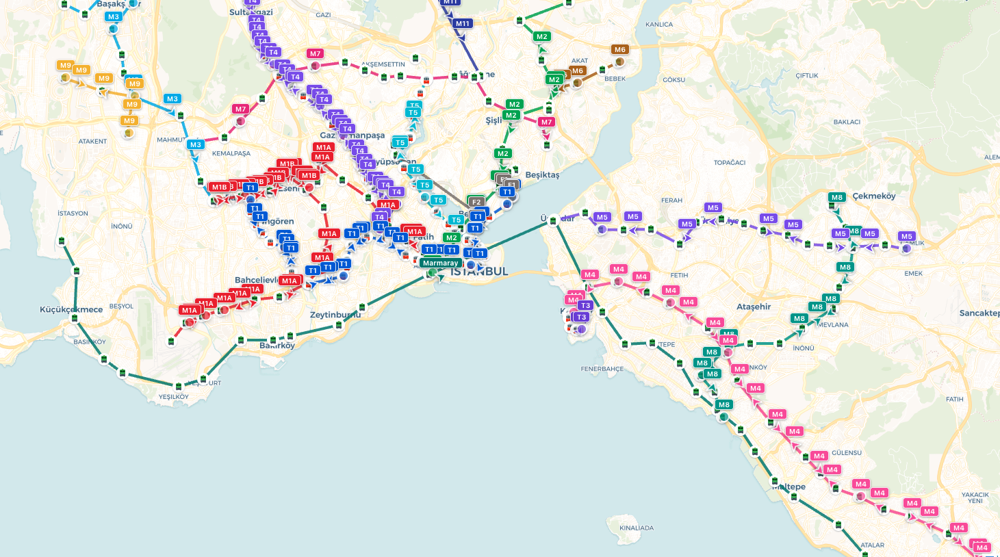
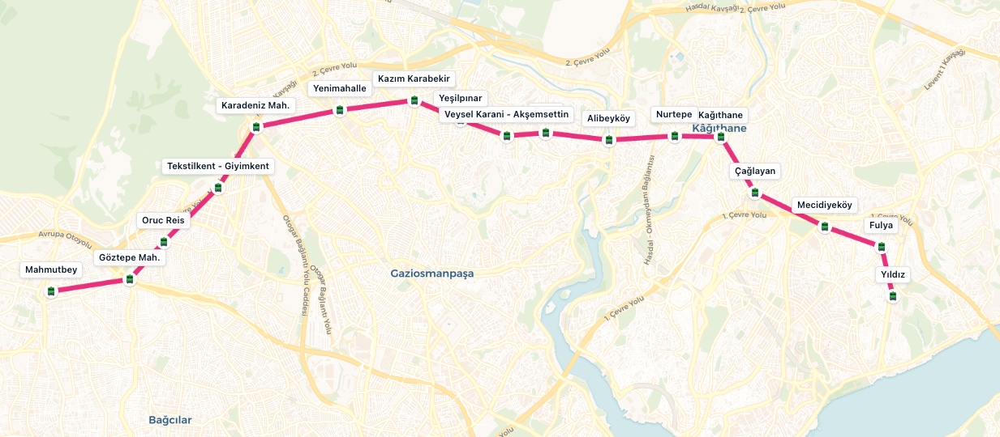

Istanbul has a complex public transportation system and recently one of the critical station got closed due to an underwater flow accident. This distruption made a huge impact on the people
who use the line to go to work (it includes me). People got creative new routes to overcome this problem (me too, discovered new paths).

Currently there is no official UI for viewing live train and bus positions but there is an official API that returns everything we need. So I just built a basic app to view operating transportations live.
Named it [tarif.ist](https://tarif.ist). "Tarif" means recipe, guidance. and .ist is for Istanbul.

It is basically parsing and manipulating publicly available data and serving it to the end user in a formatted and easy to understand way. All the source code available publicly, you can find it [here](https://github.com/berkaycubuk/tarif.ist).

Right now it focuses on train lines and bus lines are on the way.
