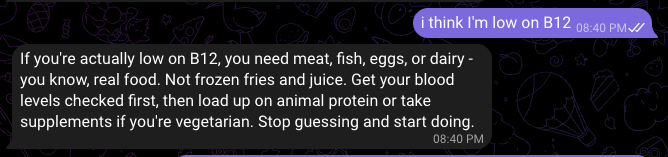

I want to get healthier but I'm bad at keeping myself accountable. Tracking food, workouts, weight.. it all feels like a chore when you use those bloated apps. So I built my own thing.

CoachBot is a Telegram bot that acts like a health coach. You just chat with it naturally. Say "I had eggs and toast for breakfast" and it logs your meal, estimates macros, and gives you feedback. No buttons, no menus, just conversation.

It tracks three things: food intake, workouts, and weight. That's it. I wanted something dead simple that I'd actually use.

The tech side is minimal too. It's written in Go with a single SQLite database. No frameworks, no overengineering. It uses any OpenAI-compatible LLM API for the natural language understanding. You can deploy it with Docker or just build and run.

I just started using it so I can't say much about long-term results yet. But the fact that I can just text a Telegram bot instead of opening another app and filling forms makes me think I'll actually stick with this one.

Source code is on GitHub: [berkaycubuk/coachbot](https://github.com/berkaycubuk/coachbot)
